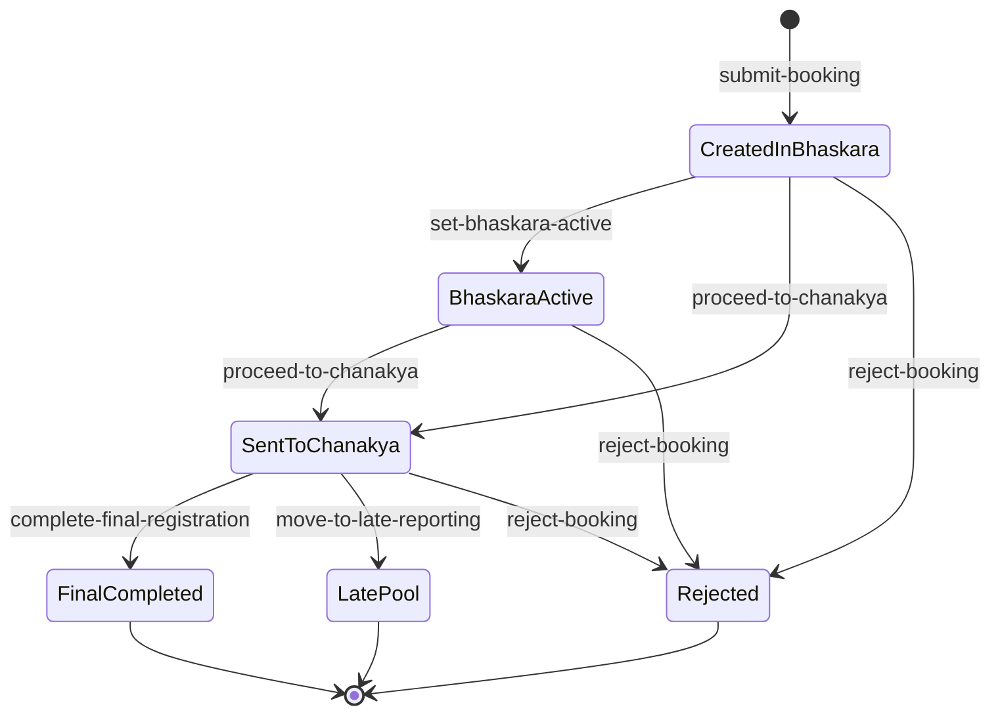

# NITC Physical Reporting Queue System - Complete Working Flow

This document explains the **entire runtime flow** of the current Flask app (`app.py`) and the UI templates, including user clicks, API calls, decisions, and outcomes.

## 1. System Modules

- `Student Portal`: Login, booking, token view, live status, final slip view.
- `Bhaskara Admin` (`/admin.html`): Queue intake and transfer to Chanakya.
- `Chanakya Admin` (`/admin2.html`): Final verification, completion, rejection, late-pool move.
- `Late Reporting Pool` (`/lateadmin.html`): Read-only late cases.
- `Server Admin` (`/server-admin`): Create/remove student credentials.
- `Password Reset` (`/forgot-password.html`): OTP-based reset.

## 2. End-to-End Master Flowchart

```mermaid
flowchart TD
    A[Open /] --> B{Login role}

    B -->|Student| C[/login role=student/]
    C -->|Success| D[/student.html/]
    C -->|Fail| B

    B -->|Admin| E[/login role=admin + hallRole/]
    E -->|bhaskara| F[/admin.html/]
    E -->|chanakya| G[/admin2.html/]
    E -->|Fail| B

    D --> H{Has existing booking?}
    H -->|No| I[Click Book Token Now]
    I --> J[/book-token.html/]
    J --> K[Submit booking -> /submit-booking]
    K -->|Success| L[/success-token.html/]
    K -->|Validation fail| J

    H -->|Yes| M[Click View Live Status]
    M --> N[/livestatus.html/]

    L --> N

    F --> O[Select student card]
    O --> P[/set-bhaskara-active]
    O --> Q{Admin action}
    Q -->|Proceed to Chanakya| R[/proceed-to-chanakya]
    Q -->|Reject| S[/reject-booking]

    R --> G

    G --> T{Chanakya action}
    T -->|Complete final registration| U[/complete-final-registration]
    U --> V[Open final print /final-registration-print/<id>]
    T -->|Move to late reporting| W[/move-to-late-reporting]
    T -->|Reject| S

    W --> X[/lateadmin.html/]

    D --> Y{Final registration completed?}
    Y -->|Yes| Z[Click See Final Admission Slip]
    Z --> V
```

## 3. Click-by-Click Flow (All Functional Clicks)

## 3.1 Login Page (`/`, `templates/login.html`)

1. Click `Student` tab.
- UI only; switches visible form.

2. Enter email + password and click `Login with NITC ID`.
- Calls `POST /login` with `role=student`.
- Success: redirects to `student.html`.
- Fail: alert `Invalid student login`.

3. Click `Admin` tab.
- UI only; switches admin form.

4. Enter admin ID + password + hall role and click `Login as Admin`.
- Calls `POST /login` with `role=admin` and hall role.
- If hall role is `chanakya`: redirect `admin2.html`.
- Else: redirect `admin.html`.
- Fail: alert `Invalid admin login`.

5. Click `Forgot password?`.
- Opens `/forgot-password.html`.

6. Click `Open Server Admin`.
- Opens `/server-admin`.

7. Settings icon -> click `Logout` (if shown by `site.js`).
- Calls `POST /logout`.
- Session cleared and redirect to `/`.

## 3.2 Forgot Password (`/forgot-password.html`)

1. Step 1 form: click `Send OTP`.
- Calls `POST /password/otp/request`.
- Always returns generic message (prevents account enumeration).

2. Step 2 form: click `Verify OTP`.
- Calls `POST /password/otp/verify`.
- Valid OTP within 10 min and <=5 wrong attempts: success.
- Else returns error (expired/invalid/too many attempts).

3. Step 3 form: click `Reset Password`.
- Requires previous OTP verification in UI + backend.
- Calls `POST /password/reset` with email, otp, new password.
- On success, password hashed and OTP invalidated; redirects to `/`.

## 3.3 Student Dashboard (`/student.html`)

1. Book button state auto-changes:
- If no booking and before 5 PM local browser time: disabled countdown.
- At/after 5 PM: button enabled `Book Token Now`.
- If booking exists: button becomes `View Live Status`.

2. Click primary button (`bookBtn`).
- If no booking: redirects `/book-token.html`.
- If booking exists: redirects `/livestatus.html`.

3. If final registration completed: click `See Final Admission Slip`.
- Opens `/final-registration-print/<booking_id>`.
- Student allowed only for own booking and only after final completion.

4. Footer clicks:
- `terms.html`, `privacy.html`, `helpdesk.html` are static pages.

## 3.4 Booking Page (`/book-token.html`)

1. Click fee radio:
- `Fee Paid` -> requires fee receipt upload.
- `Not Paid` -> requires unpaid payment mode (On Spot / Education Loan).

2. Upload files:
- Mandatory: `Class 10`, `Class 12`.
- Optional: `Category`.
- Conditional mandatory: `Fee receipt` when fee paid.

3. Click slot card:
- Selects slot only if capacity is enough.
- Capacity rule:
  - fee=`yes` consumes 1 seat.
  - fee=`no` consumes 2 seats.

4. Click `Submit Booking`.
- Frontend validations run first.
- Calls `POST /submit-booking` as `multipart/form-data`.
- Backend checks:
  - student session exists,
  - fee/slot/payment validity,
  - mandatory docs,
  - one booking per student,
  - slot capacity availability.
- Success:
  - token generated (`TKN-xxx`),
  - files saved to `instance/uploads`,
  - slot capacity reduced,
  - redirect `/success-token.html`.
- Failure: alert with backend error message.

## 3.5 Success Page (`/success-token.html`)

1. Click `View Live Queue Status`.
- Opens `/livestatus.html`.

2. Click `Dashboard`.
- Opens `student.html`.

3. Support link points to `micellaneous/helpdesk.html` (static template).

## 3.6 Live Status (`/livestatus.html`)

- Read-only page for student.
- Shows:
  - now serving token,
  - own token,
  - students ahead,
  - expected wait time (`3*x + 6*y`),
  - hall progress,
  - upcoming tokens.

No action buttons except global settings/logout.

## 3.7 Bhaskara Admin (`/admin.html`)

1. Click any student card (Quick or Detailed queue).
- Fills detail panel.
- Calls `POST /set-bhaskara-active` for selected booking.
- This sets only one `is_bhaskara_active=True` globally.

2. Click `Proceed to Chanakya`.
- Calls `POST /proceed-to-chanakya` with `booking_id` and notes.
- Marks booking `sent_to_chanakya=True`, leaves Bhaskara queue.
- Page reloads.

3. Click `Reject` on row or `Reject Profile` in detail panel.
- Calls `POST /reject-booking`.
- Restores slot capacity by fee type,
- deletes uploaded files,
- deletes booking row.

4. Click `Switch Station`.
- Navigates to `/admin2.html`.

5. Click `Late Reporting Pool` nav.
- Navigates to `/lateadmin.html`.

6. `Dispatch Next Batch` button currently only writes localStorage event; no backend dispatch logic.

## 3.8 Chanakya Admin (`/admin2.html`)

1. Click queue entry at right (`?booking=<id>`).
- Reloads page with selected active booking.

2. Click any `View` document link.
- Opens `/uploads/<filename>`.
- Backend allows only when `admin_email` session exists.

3. Click `Complete Final Registration`.
- Calls `POST /complete-final-registration`.
- Sets `final_registration_completed=True`, timestamp, deactivates Bhaskara active state.
- Returns `print_url`; frontend opens print page.
- Reloads to update status.

4. Click `Send to Late Reporting`.
- Prompt asks reason.
- Calls `POST /move-to-late-reporting` with reason.
- Marks late flags + sets sent_to_chanakya true.
- Student appears in `/lateadmin.html`.

5. Click `Reject Profile`.
- Calls `POST /reject-booking` and removes booking/files.

6. Click `Switch Station`.
- Navigates to `/admin.html`.

## 3.9 Final Print (`/final-registration-print/<id>`)

1. Click `Print A4`.
- Browser print dialog (`window.print()`).

2. Click `Close`.
- `window.close()`.

Access control:
- Admin can open any existing booking print.
- Student can open only own booking and only after final completion.

## 3.10 Late Reporting Page (`/lateadmin.html`)

- Read-only listing of late moved students and reasons.
- Click `Chanakya Desk` -> `/admin2.html`.
- Click `Bhaskara Desk` -> `/admin.html`.

## 3.11 Server Admin (`/server-admin`)

1. Login form -> click `Login`.
- `POST /server-admin/login`.
- Credentials checked against `ServerAdminCredential` table.

2. Click `Add Student`.
- `POST /server-admin/students/add`.
- Creates student with hashed password.
- Duplicate email blocked.

3. Click `Remove` on student row.
- Confirmation dialog.
- `POST /server-admin/students/remove`.

4. Click `Logout`.
- `POST /server-admin/logout`.

## 4. Data and Queue Rules

- Slot defaults: 8 slots from 9 AM to 5 PM, each capacity 40.
- Capacity consumption:
  - Fee paid (`yes`) -> 1 unit.
  - Fee unpaid (`no`) -> 2 units.
- One active booking per student email (hard blocked).
- Token format: `TKN-<3 digits>` unique across bookings.
- Uploaded docs stored in `instance/uploads` with unique generated filename.

## 5. State Transitions for a Booking



## 6. API Summary (Current App)

- Auth/session:
  - `POST /login`
  - `GET|POST /logout`
- Student:
  - `POST /submit-booking`
  - `GET /student.html`
  - `GET /book-token.html`
  - `GET /success-token.html`
  - `GET /livestatus.html`
- Admin Bhaskara:
  - `GET /admin.html`
  - `POST /set-bhaskara-active`
  - `POST /proceed-to-chanakya`
  - `POST /reject-booking`
- Admin Chanakya:
  - `GET /admin2.html`
  - `POST /complete-final-registration`
  - `POST /move-to-late-reporting`
  - `GET /final-registration-print/<id>`
- Late desk:
  - `GET /lateadmin.html`
- Password reset:
  - `POST /password/otp/request`
  - `POST /password/otp/verify`
  - `POST /password/reset`
- Server admin:
  - `GET /server-admin`
  - `POST /server-admin/login`
  - `POST /server-admin/logout`
  - `POST /server-admin/students/add`
  - `POST /server-admin/students/remove`
- Files:
  - `GET /uploads/<filename>` (admin session required)

## 7. Important Notes for Current Build

- Admin login checks plain-text password in `Admin` table (`email + password` exact match), unlike students/server-admin where hashing is supported.
- `SECRET_KEY` is hardcoded as `"secret"` in `app.py`.
- `/set-40` endpoint resets all slot capacities to 40 without auth guard.
- Some UI links are placeholders (`href="#"`) and do not trigger backend actions.
- `site.js` has extra generic API wrapper methods not used by current Flask routes; real login flow uses direct `/login` fetch.
